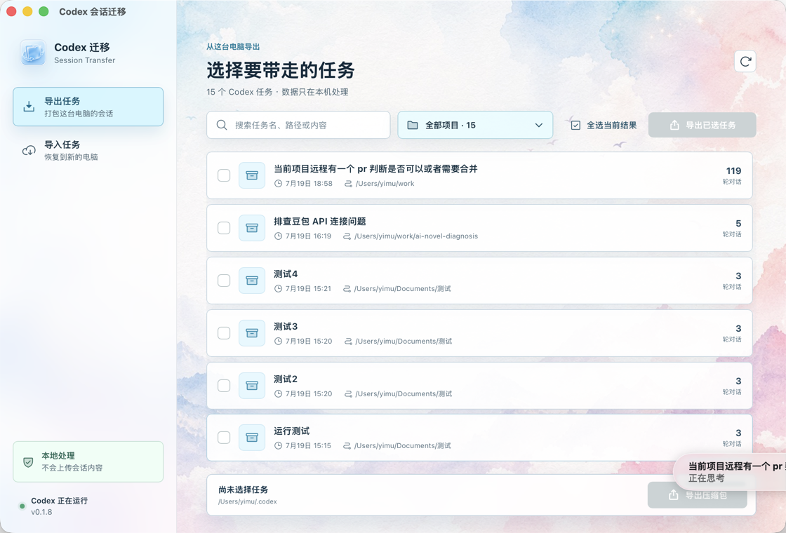
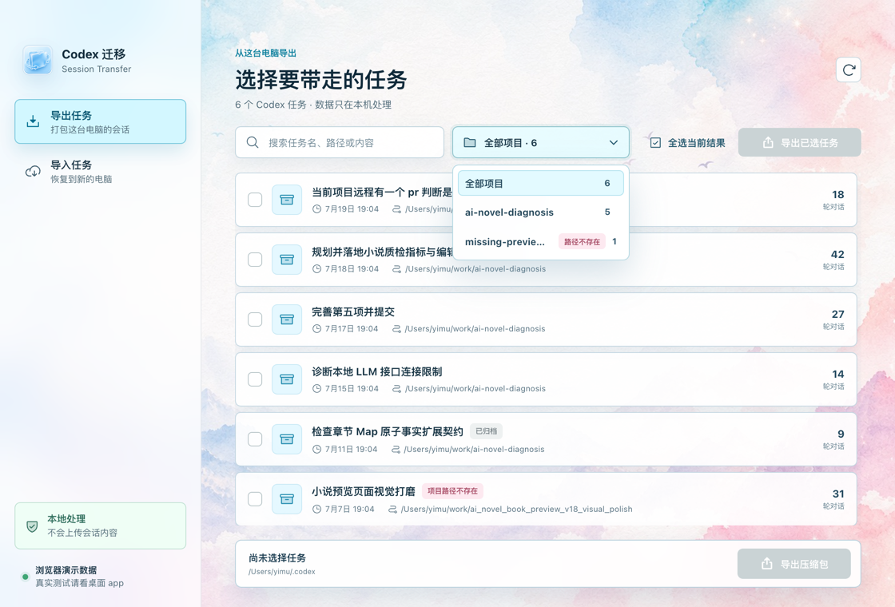
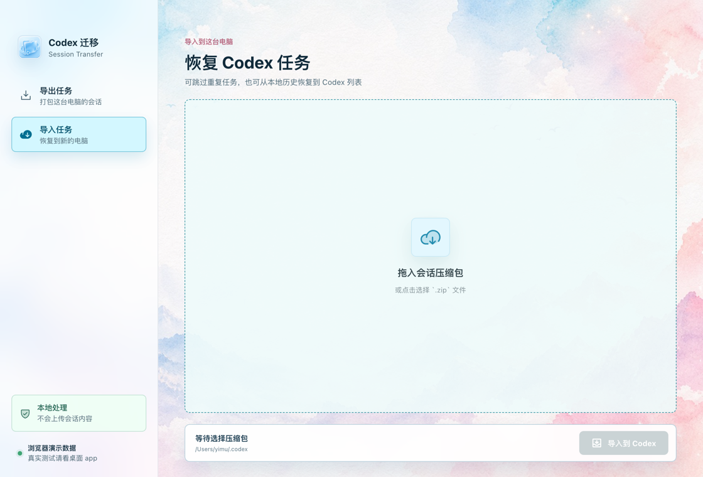
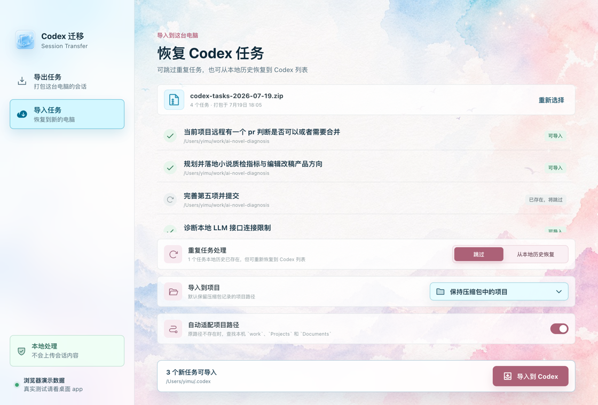

# Codex Session Transfer

A local-first desktop app for exporting, importing, syncing, and restoring Codex project task sessions across computers.

It scans local Codex task history, displays tasks by project and title, exports selected sessions into a ZIP archive, and imports that archive into the current Codex data directory on another machine. All processing happens locally; session content is not uploaded.

[中文 README](./README.md)



## About

Codex Session Transfer is designed for:

- Moving Codex project task sessions from an old computer to a new one.
- Syncing selected Codex task history across multiple machines without copying the entire `.codex` directory.
- Backing up important task sessions, including project paths, task titles, original session logs, and optional browser session config.
- Restoring existing local session files back into the Codex task list when the files exist locally but no longer appear in the Codex sidebar.

Suggested GitHub repository About description:

```text
Local-first desktop utility for exporting, importing, syncing, and restoring selected Codex project task sessions across computers.
```

## Features

- **Export tasks**: scan local Codex task history and export selected tasks as a ZIP archive.
- **Project grouping**: filter tasks by Codex project from the project picker next to the search box.
- **Task search**: search by task title, project path, and session content.
- **Project state labels**: missing projects or projects not shown in the Codex sidebar are marked and placed later in the picker.
- **Import tasks**: preview an archive and import it into the current Codex data directory.
- **Duplicate handling**: skip existing task IDs by default, or restore existing local history back into the Codex task list.
- **Target project selection**: choose which local project imported or restored tasks should appear under.
- **Path adaptation**: map old missing project paths to same-name folders under `~/work`, `~/Projects`, and `~/Documents`.
- **Running-app protection**: import is blocked while the Codex/ChatGPT desktop main process is running, preventing the client from overwriting restored sidebar state.
- **Local backups**: backup Codex SQLite databases and global state before importing.

## App Guide

### 1. Export Tasks

The app opens on the Export Tasks page. The list shows task titles, update time, project path, and conversation count. Select tasks, then click an Export button.


### 2. Filter by Project

Click the project picker next to the search box to filter tasks by project. Missing, deleted, or hidden projects are labeled so you can decide whether to migrate or restore them.



### 3. Import an Archive

Switch to Import Tasks, then drag or choose a `.zip` archive created by this app. The app previews the archive before writing anything to Codex data.



### 4. Handle Duplicates and Target Project

After selecting an archive, each task receives an import status:

- `Ready`: the task does not exist locally and can be imported.
- `Already exists, skip`: the same task ID exists locally and will not be overwritten.
- `Restore from local history`: re-register an existing local session into the Codex task list.

You can also choose a target project so imported or restored tasks appear under the intended Codex project group.



## Usage

### Export from the old computer

1. Open `Codex Session Transfer`.
2. Go to Export Tasks.
3. Use search or the project picker to find the sessions you want to move.
4. Select tasks, or use Select Current Results.
5. Click Export Archive and save the generated `codex-tasks-YYYY-MM-DD.zip`.

### Import on the new computer

1. Copy the ZIP archive to the new computer.
2. Fully quit the Codex/ChatGPT desktop app, preferably with `Cmd + Q` on macOS.
3. Open `Codex Session Transfer` and go to Import Tasks.
4. Choose the ZIP archive and review the preview.
5. Choose duplicate handling, target project, and path adaptation options.
6. Click Import to Codex.
7. Reopen Codex/ChatGPT and check the restored projects and tasks in the sidebar.

## Duplicate and Restore Rules

Imports do not overwrite existing tasks by default. The app detects duplicates by Codex task ID:

- New task IDs are written into the Codex session directory.
- Existing local tasks are skipped by default.
- Restore from local history re-registers an existing local session into the Codex task list and clears archived/hidden state.
- Target project selection binds imported or restored tasks to the selected local project.
- Import is blocked while Codex/ChatGPT is running to avoid sidebar state being overwritten by the running client.

## Download

Download the latest build from GitHub Releases:

- macOS: `Codex-Session-Transfer-*-arm64.zip`
- Windows: `Codex-Session-Transfer-*-Windows-portable.zip`

On macOS, unzip the archive and open the `.app`. If macOS blocks the app, right-click it in Finder and choose Open.

## Local Development

```bash
npm install
npm run dev
```

Web-only preview:

```bash
npm run dev:web
```

## Packaging

macOS:

```bash
npm run build:mac
```

Windows:

```bash
npm run build:win
```

Build outputs are written to `release/`.

## Archive Format

The exported ZIP contains a root `manifest.json`. Each task is stored under `tasks/<task-id>/` and includes the original `session.jsonl` plus an optional `browser.toml`.

Current schema version:

```text
codex-session-transfer/v1
```

## Privacy

The app only reads your local Codex data directory and creates or imports local ZIP files. It does not upload session content and does not require a server.
